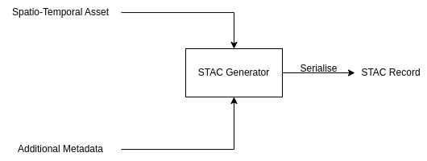

# Introduction

## Terminologies

`stac_generator` generates a STAC collection from information that can be extracted from the spatio-temporal asset and from data provided by users.



A STAC item is a core component of the STAC specification, designed to describe a single geospatial asset or dataset. The key attributes of a STAC item includes:  
- `id`: identifier 
- `datetime`: the timestamp when the item is collected
- `asset`: information about the asset, primarily its location `href`. 
- `geometry`: item geometry type and coordinates
- `bbox`: item bounding box 

<details>
<summary>Example STAC Item</summary>

```json
{
  "type": "Feature",
  "stac_version": "1.0.0",
  "stac_extensions": [
    "https://stac-extensions.github.io/projection/v1.1.0/schema.json",
    "https://stac-extensions.github.io/eo/v1.1.0/schema.json",
    "https://stac-extensions.github.io/raster/v1.1.0/schema.json"
  ],
  "id": "L2A_PVI",
  "geometry": {
    "type": "Polygon",
    "coordinates": [
      [
        [
          15.110630736098942,
          36.95292538275869
        ],
        [
          15.110630736098942,
          37.947537561322136
        ],
        [
          13.876365195204773,
          37.947537561322136
        ],
        [
          13.876365195204773,
          36.95292538275869
        ],
        [
          15.110630736098942,
          36.95292538275869
        ]
      ]
    ]
  },
  "bbox": [
    13.876365195204773,
    36.95292538275869,
    15.110630736098942,
    37.947537561322136
  ],
  "properties": {
    "proj:code": "EPSG:32633",
    "proj:shape": [
      343,
      343
    ],
    "proj:transform": [
      320.0,
      0.0,
      399960.0,
      0.0,
      -320.0,
      4200000.0,
      0.0,
      0.0,
      1.0
    ],
    "eo:bands": [
      {
        "name": "b04",
        "common_name": "red",
        "description": "Common name: red",
        "center_wavelength": 0.6645
      },
      {
        "name": "b03",
        "common_name": "green",
        "description": "Common name: green",
        "center_wavelength": 0.56
      },
      {
        "name": "b02",
        "common_name": "blue",
        "description": "Common name: blue",
        "center_wavelength": 0.4966
      }
    ],
    "eo:cloud_cover": 0.0,
    "eo:snow_cover": 0.0,
    "datetime": "2021-02-21T09:10:17Z",
    "start_datetime": "2021-02-21T09:10:17Z",
    "end_datetime": "2021-02-21T09:10:17Z"
  },
  "links": [
    {
      "rel": "root",
      "href": "http://example.com/collection.json",
      "type": "application/json",
      "title": "Auto-generated."
    },
    {
      "rel": "collection",
      "href": "http://example.com/collection.json",
      "type": "application/json",
      "title": "Auto-generated."
    },
    {
      "rel": "self",
      "href": "http://example.com/L2A_PVI/L2A_PVI.json",
      "type": "application/json"
    },
    {
      "rel": "parent",
      "href": "http://example.com/collection.json",
      "type": "application/json",
      "title": "Auto-generated."
    }
  ],
  "assets": {
    "data": {
      "href": "tests/files/integration_tests/raster/data/L2A_PVI.tif",
      "type": "image/tiff; application=geotiff",
      "title": "Raster Data",
      "raster:bands": [
        {
          "nodata": 0,
          "data_type": "uint16"
        },
        {
          "nodata": 0,
          "data_type": "uint16"
        },
        {
          "nodata": 0,
          "data_type": "uint16"
        }
      ],
      "eo:bands": [
        {
          "name": "b04",
          "common_name": "red",
          "description": "Common name: red",
          "center_wavelength": 0.6645
        },
        {
          "name": "b03",
          "common_name": "green",
          "description": "Common name: green",
          "center_wavelength": 0.56
        },
        {
          "name": "b02",
          "common_name": "blue",
          "description": "Common name: blue",
          "center_wavelength": 0.4966
        }
      ],
      "roles": [
        "data"
      ]
    }
  },
  "collection": "raster_data"
}
```
</details>


Collection is a set of STAC Item. It is used to group related STAC Items that share common properties, metadata, or themes. A collection provides a higher-level metadata description for a dataset or group of assets: 
- `id`: collection id 
- `spatial_extent`: areal coverage 
- `temporal_extent`: temporal coverage 
- `links`: associated child items and assets

<details>
<summary>Example Collection JSON</summary>

```json
{
  "type": "Collection",
  "id": "raster_data",
  "stac_version": "1.0.0",
  "description": "Auto-generated",
  "links": [
    {
      "rel": "root",
      "href": "http://example.com/collection.json",
      "type": "application/json",
      "title": "Auto-generated."
    },
    {
      "rel": "item",
      "href": "http://example.com/L2A_PVI/L2A_PVI.json",
      "type": "application/json"
    },
    {
      "rel": "self",
      "href": "http://example.com/collection.json",
      "type": "application/json"
    }
  ],
  "title": "Auto-generated.",
  "extent": {
    "spatial": {
      "bbox": [
        [
          13.876365195204773,
          36.95292538275869,
          15.110630736098942,
          37.947537561322136
        ]
      ]
    },
    "temporal": {
      "interval": [
        [
          "2021-02-21T09:10:17Z",
          "2021-02-21T09:10:17Z"
        ]
      ]
    }
  },
  "license": "proprietary"
}

```
</details>


To run the `stac_generator`, a config file must be provided. In essence, the config file contains the asset locations and additional user-supplied metadata, from which the STAC Item is generated. Refer to quick start to see how to build a simple config, or refer to the specication to see what fields are supported in the config. 

## Data Types

`stac_generator` classifies assets into `raster`, `vector`, and `point` data, using terminologies consistent with common [GIS](https://gisgeography.com/spatial-data-types-vector-raster/#:~:text=Vector%20data%20expresses%20by%20point,2021%20at%208%3A14%20pm) softwares. In general:

- Point data contains one or more entries where each entry has the `X` and `Y` fields describing the location. Each entry usually contains other fields describing the attributes at the point location. For instance, this can be soil sample measurements or raw instrument readings at a particular coordinate. Point data can also have a field representing depth/elevation or time.
- Vector data contains a collection of points whose relationship is determined by the vector type - (point, multipoint, line, multiline, polygon, multipolygon, etc). Vector data are usually shape files describing a plot or a field boundary, but can also contain plot level attributes - i.e. mean elevation, mean temperature, cumulative rainfall, etc.
- Raster data contains several 2D layers (called bands) where each band represents the attribute value at each (x, y) coordinate in the 2D grid. For instance, an orthomosaic contains RGB bands, where each band is a 2D matrix with value between 0 and 255.

## Supported Formats for data assets

- Raster:
    - tif
    - geotif
- Vector:
    - shp
    - geojson
    - zip+shp
    - geopkg
- Point:
    - csv
    - txt

Note that in some cases, plot or field level attributes are recorded in a csv that does not contain X and Y columns but a plot or field ID column referencing the same attribute in a separate vector file. This additional information can be provided using the `join_` keywords in the vector config. Please see the documentation for more information. 

## Collection metadata

Aside from `datetime`, `start_datetime`, `end_datetime`, collection metadata contains fields described in [STAC Common Metadata](https://github.com/radiantearth/stac-spec/blob/master/commons/common-metadata.md). In general, the most important fields are `id` (required), `keywords` (optional - can be useful for catalog filtering feature in the future), `license` (optional - licensing information).

For a more detailed list of all fields, their data types, and default values, please refer to `STACCollectionConfig` under [this](schema.md) link.

## Item metadata

Item metadata contains all fields in collection metadata and additional required `collection_date` and `collection_time` fields describing when the item was collected. Item metadata must also specify the `location` field, that points to where the data asset is stored.

For a more detailed list of all fields, their data types, and default values, please refer to `STACItemConfig` and `SourceConfig` under [this](schema.md) link.

### Point metadata

Point metadata contains all fields in item metadata (inherits from `SourceConfig`) and contains additional fields specifying how to process the given csv/txt file. This includes the `X` and `Y` fields specifying the columns to be treated as the X and Y coordinates, the `epsg` code specifying the CRS of the XY coordinates, and if the csv contains columns to be treated as depth/elevation or time, the optional `Z`, `T` and `time_format` fields.

Users should also specify useful columns under `column_info` (please see `ColumnInfo` and `HasColumnInfo` under [this](schema.md) link). For a more detailed list of all fields, their data types, and default values, please refer to `CSVConfig` under [this](extensions/point/schema.md) link.

### Vector metadata

Vector metadata contains all fields in item metadata (inherits from `SourceConfig`). Since vector data is often self-described, vector metadata only requires the `epsg` code for sanity checking - i.e. to ensure that users know whether they are providing the right asset. If the vector data is a compressed zip file with multiple shp files, a `layer` field is needed to specify which `shp` file in the zip package the metadata is describing. If the vector data contains plot or field level attributes, the `column_info` should also be used.

Users should also specify useful columns under `column_info` (please see `ColumnInfo` and `HasColumnInfo` under [this](schema.md) link). For a more detailed list of all fields, their data types, and default values, please refer to `VectorConfig` under [this](extensions/vector/schema.md) link.

A common practice in spatial application involves storing geometry information in one table and attributes in another, and a join operation is performed at run time to generate the combined data. To simplify the workflow, we assume the geometry information is stored in a vector file and the attributes stored in a csv. We can specify `join_file` to be the path to the attribute csv file. `join_field` to be a column in `join_file` and `join_attribute_vector` to be an attribute in the vector file. The two files will be joined at each record where `join_file` = `join_attribute_vector`. `join_column_info` must also be provided to describe the columns in the `join_file`. 

### Raster metadata

Raster metadata contains all fields in item metadata (inherits from `SourceConfig`). `band_info` is the only required field in a raster config.

For a more detailed list of all fields, their data types, and default values, please refer to `RasterConfig` under [this](extensions/raster/schema.md) link.

