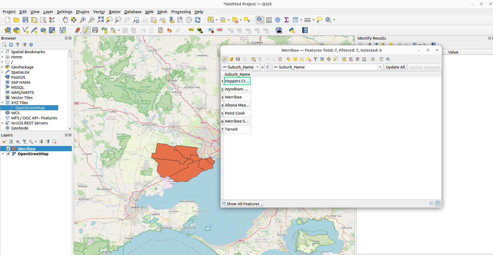
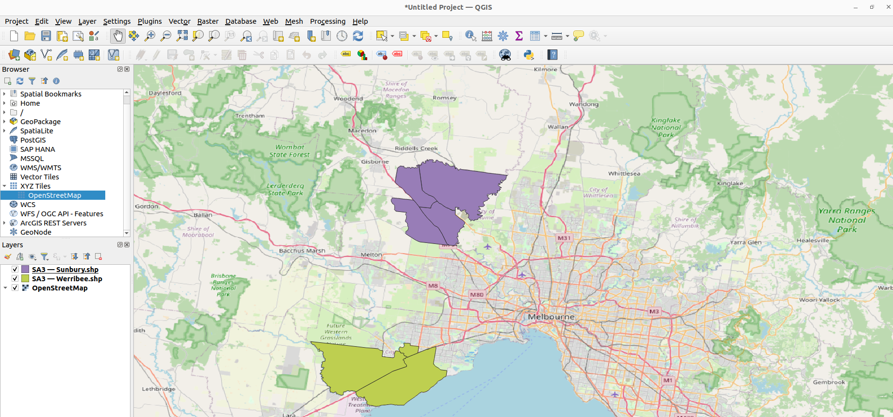

# Quickstart

## Help

To view the supported parameters and keywords for the `serialise` command, run

```
stac_generator serialise --help
```

To view all supported commands, run

```
stac_generator --help
```

Note that  `STAC common metadata` fields can be ignored for now.

## Setup

In the following tutorial, we will use the `stac_generator` to describe a vector file. For starter, please download this [file](https://object-store.rc.nectar.org.au/v1/AUTH_2b454f47f2654ab58698afd4b4d5eba7/mccn-test-data/documentation/quickstart/Werribee.geojson), which contains some suburbs in Werribee Melbourne.

If you have QGIS, you can visualise the layer:


Create a folder called `Example`, move the downloaded file to `Example`, then open a terminal in `Example`.

## Describing a vector file

Before using the stac generator, we will write a config file to be passed to the `stac_generator`. A config file is a csv or json file that describes a set of STAC items in a collection. At the bare minimum, it must contain the path to the asset, the STAC Item unique identifier (id), and the date and time when the asset was collected. Our very first, very simple config will look like this:

<details>
<summary>JSON</summary>

```json
[
    {
        "id": "Werribee",
        "location": "Werribee.geojson",
        "collection_date": "2025-01-01",
        "collection_time": "00:00:00"
    }
]
```
</details>

<details>
<summary>CSV</summary>

```csv
id,location,collection_date,collection_time
Werribee,Werribee.geojson,2025-01-01,00:00:00
```
</details>

In this example, the item's id is `Werribee`. The asset location is `Werribee.geojson`, which means `Werribee.geojson` should be discovered in the current directory `Example`. We have also provided the `collection_date` and `collection_time` in the config. Save the config file (either the csv or json) in the current directory - i.e `simple_config.json`.

Now run the stac generator serialise command from the terminal:

```bash
stac_generator serialise simple_config.json --id Werribee_Collection --dst generated
```

The first positional argument is the path to the config file. The first keyword argument `id` (required) is the id of the generated collection. The second keyword argument `dst` is the location the generated records should be saved.

Once this command is run, we should see a generated folder in the current directory. Upon opening `generated`, you will see a `collection.json` which is the STAC Collection metadata, and a `Werribee` folder containing `Werribee.json`, which is the STAC item metadata.

You can now verify that the `id` provided in the command line (`Werribee_Collection`) corresponds to the `id` in `collection.json`, the `id` in `Werribee.json` corresponds to the `id` provided in `simple_config.json`, and the asset's href in `Werribee.json` corresponds to the `location` provided in `simple_config.json`.

## Describing vector attributes

So far, we have learned to write a bare-minimum config to describe a vector asset and use the stac generator command to generate the metadata record. In this example, we will learn how to add additional metadata to better describe the asset. For instance, we now want to add a `title` and a `description` to our STAC record. We also want to describe some attributes contained in the vector file. For instance, we can see that `Werribee.geojson` has an attribute called `Suburb_Name`:



<details>
<summary>JSON</summary>

```json
[
    {
        "id": "Werribee",
        "location": "Werribee.geojson",
        "collection_date": "2025-01-01",
        "collection_time": "00:00:00",
        "title": "Werribee Item",
        "description": "Suburbs near Werribee Melbourne",
        "column_info": [{"name": "Suburb_Name", "description": "suburb name"}]
    }
]
```
</details>

Save this config as `detailed_config.json` in the same folder. Now run the command

```bash
stac_generator serialise detailed_config.json --id Werribee_Collection --dst generated
```

Upon checking the generated STAC Item `Werribee.json`, we now see `column_info`, `title`, and `description` fields appearing under `properties`.

## Describing joined attributes

A common practice in spatial application involves storing geometry information in one table and attributes in another, and a join operation is performed at run time to generate the combined data. To simplify the workflow, we assume the geometry information is stored in a vector file and the attributes stored in a csv. The stac generator can describe the join operation with a few extra keywords in the config. Before running the stac generator, download the join [file](https://object-store.rc.nectar.org.au/v1/AUTH_2b454f47f2654ab58698afd4b4d5eba7/mccn-test-data/documentation/quickstart/distance.csv) and put it in the current directory `Example`. Our config now looks like this:


```json
[
    {
        "id": "Werribee",
        "location": "Werribee.geojson",
        "collection_date": "2025-01-01",
        "collection_time": "00:00:00",
        "column_info": [
            {
                "name": "Suburb_Name",
                "description": "Suburb_Name"
            }
        ],
        "join_file": "distance.csv",
        "join_field": "Area",
        "join_attribute_vector": "Suburb_Name",
        "join_column_info": [
            {
                "name": "Distance",
                "description": "Driving Distance to CBD in km"
            },
            {
                "name": "Public_Transport",
                "description": "Time taken to reach CBD by public transport in minutes"
            },
            {
                "name": "Drive",
                "description": "Time taken to reach CBD by driving in minutes"
            },
            {
                "name": "Growth",
                "description": "Average 5 year growth in percentage in 2025"
            },
            {
                "name": "Yield",
                "description": "Average rental yield in 2025"
            }
        ]
    }
]
```
</details>

We specified `join_file` to be the path to the attribute csv file. `join_field` to be a column in `join_file` and `join_attribute_vector` to be an attribute in the vector file. The two files will be joined at each record where `join_file` = `join_attribute_vector`. `join_column_info` describes the columns in the `join_file`. Save the new config as `join_config.json` and run the stac generator command:

```bash
stac_generator serialise join_config.json --id Werribee_Collection --dst generated
```

You should see the corresponding fields appearing under `properties` in `Werribee.json`.


## Describing multi-layerd shape file

It is not uncommon to have a compressed zip containing multiple shape files. To get started, download this [file](https://object-store.rc.nectar.org.au/v1/AUTH_2b454f47f2654ab58698afd4b4d5eba7/mccn-test-data/documentation/quickstart/SA2.zip) which contains some SA2 areas in Victoria:



Here we have two layers - Sunbury and Werribee. Each layer will be generated as a STAC item, and we will need to describe each layer independently as a record in the config. We may choose to describe all or a subset of the layers.

<details>
<summary>JSON</summary>

```json
[
    {
        "id": "WerribeeSA2",
        "location": "SA2.zip",
        "collection_date": "2025-01-01",
        "collection_time": "00:00:00",
        "layer": "Werribee"
    },
    {
        "id": "SunburySA2",
        "location": "SA2.zip",
        "collection_date": "2025-01-01",
        "collection_time": "00:00:00",
        "layer": "Sunbury"
    },
]
```
</details>

Save the new config as `layer_config.json` and run the command:

```
stac_generator serialise layer_config.json --id SA2_Collection --dst generated
```

You will see two items generated, `WerribeSA2` and `SunburySA2`. Note that each config record has a `layer` keyword to identify the layer in the compressed zip. We use a simple config to describe each layer, but it is possible to add additional information like column info and join attributes as described in the previous sections.

## Describing multiple vector files

To describe an indenpendent vector file, you can add another record in the config file. For instance, we want to describe both the `SA2.zip` and the `Werribee.geojson` files:

<details>
<summary>JSON</summary>

```json
[
    {
        "id": "WerribeeSA2",
        "location": "SA2.zip",
        "collection_date": "2025-01-01",
        "collection_time": "00:00:00",
        "layer": "Werribee"
    },
    {
        "id": "SunburySA2",
        "location": "SA2.zip",
        "collection_date": "2025-01-01",
        "collection_time": "00:00:00",
        "layer": "Sunbury"
    },
        {
        "id": "Werribee",
        "location": "Werribee.geojson",
        "collection_date": "2025-01-01",
        "collection_time": "00:00:00",
        "column_info": [
            {
                "name": "Suburb_Name",
                "description": "Suburb_Name"
            }
        ],
        "join_file": "distance.csv",
        "join_field": "Area",
        "join_attribute_vector": "Suburb_Name",
        "join_column_info": [
            {
                "name": "Distance",
                "description": "Driving Distance to CBD in km"
            },
            {
                "name": "Public_Transport",
                "description": "Time taken to reach CBD by public transport in minutes"
            },
            {
                "name": "Drive",
                "description": "Time taken to reach CBD by driving in minutes"
            },
            {
                "name": "Growth",
                "description": "Average 5 year growth in percentage in 2025"
            },
            {
                "name": "Yield",
                "description": "Average rental yield in 2025"
            }
        ]
    }
]
```
</details>

Despite its size, this is a simple concatenation of the records in the previous two sections. This will generate a `WerribeeSA2` item and a `SunburySA2` item from the `SA2.zip` file, and a `Werribe` item with join-attribute from `drive.csv`. Save the new config as `combined_config.json` and run the stac generator:

```
stac_generator serialise combined_config.json --id Vector_Collection --dst generated
```
