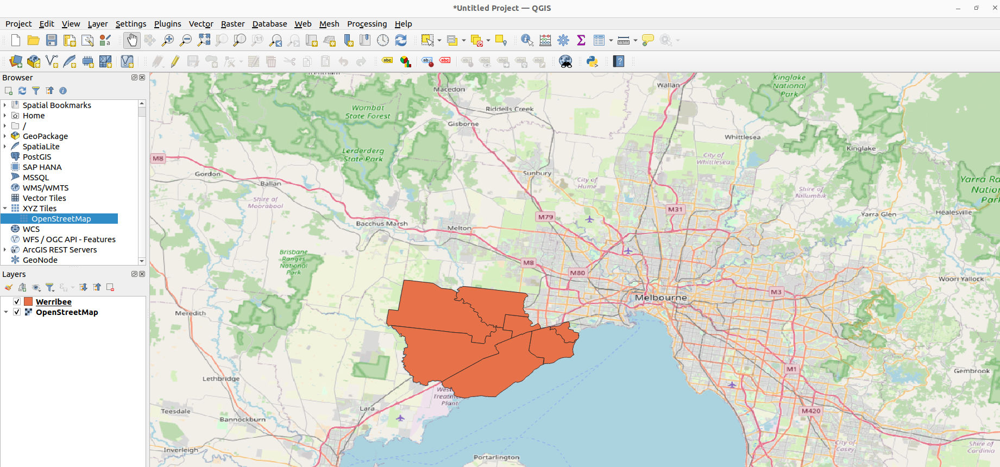

# Quickstart


## Vector Data


### Describing a vector file

In this section, we will describe the shape file `Werribee.geojson`, included in the downloaded zip file. 

If you have QGIS installed, you can open the file in QGIS to visualize the data:



#### Config

To describe the shape file, create a configuration file named `vector_simple_config` in one of the supported formats: JSON or YAML.

=== "json"

    ``` json title="vector_simple_config.json"
    [
        {
            "id": "Werribee",
            "location": "Werribee.geojson",
            "collection_date": "2025-01-01",
            "collection_time": "00:00:00"
        }
    ]
    ```

=== "yaml"

    ``` yaml title="vector_simple_config.yaml"
    - id: "Werribee"
      location: "Werribee.geojson"
      collection_date: "2025-01-01"
      collection_time: "00:00:00"
    ```


#### Explanation of Fields

- `id`: The unique identifier for the item. Here, it is Werribee.
- `location`: The relative path to the asset file (Werribee.geojson) in the Example directory.
- `collection_date`: The date the asset was collected.
- `collection_time`: The time the asset was collected.

Save the file in the current directory as vector_simple_config.json or vector_simple_config.yaml.

#### Commands and Output

Now run the stac generator serialise command from the terminal:

```bash
stac_generator serialise vector_simple_config.json
```

After running the command, a new folder named generated will appear in the current directory. Inside the generated folder, you will find:

- collection.json: Contains the STAC Collection metadata.

- Werribee/Werribee.json: Contains the STAC Item metadata for our simple vector.

The `collection.json` and `Werribee.json` files represent the metadata for your asset, compliant with the STAC specification.

### Describing vector attributes

Previously, we created a bare-minimum configuration to describe a vector asset and generated the corresponding STAC metadata. In this example, we will enhance the metadata by adding more descriptive fields such as `title` and `description`. Additionally, we will describe attributes contained within the vector file.

For instance, the shape file `Werribee.geojson` has an attribute called `Suburb_Name`:


---

#### Config 

=== "json"

    ```json title="vector_detailed_config.json"
    [
        {
            "id": "Werribee",
            "location": "Werribee.geojson",
            "collection_date": "2025-01-01",
            "collection_time": "00:00:00",
            "title": "Werribee Item",
            "description": "Suburbs near Werribee Melbourne",
            "column_info": [{"name": "Suburb_Name", "description": "suburb name"}]
        }
    ]
    ```
=== "yaml"

    ```yaml title="vector_detailed_config.yaml"
    - id: "Werribee"
      location: "Werribee.geojson"
      collection_date: "2025-01-01"
      collection_time: "00:00:00"
      title: "Werribee Item"
      description: "Suburbs near Werribee Melbourne"
      column_info:
        - name: "Suburb_Name"
          description: "suburb name"
    ```

#### Explanation of Fields

- `title`: item's title 
- `description`: item's description 
- `column_info`: contains a list of column objects with attribute `name` and `description`. This field is used 
to represent the attributes contained in the vector file.

STAC Common-metadata like `title` and `description` can be included in generated STAC records by adding them in the item config. To see a list of supported metadata, please refer to the relevant [documentation]().

### Commands and Output

Save this config as `vector_detailed_config.json`/`vector_detailed_config.yaml` in the same folder and run the serialisation command:

```bash
stac_generator serialise vector_detailed_config.json
```

The fields `title`, `description`, and `column_info` should appear correctly under the generated item's `properties`. 

### Describing joined attributes

In many spatial applications, geometry information is stored separately from attributes, typically in different tables. A join operation is performed at runtime to combine the two datasets. To simplify this workflow, we assume:

- Geometry information is stored in a vector file (e.g., `Werribee.geojson`).
- Attributes are stored in a CSV file.

The STAC generator can describe this join operation by including a few additional keywords in the configuration.

For this example, we assume the vector file `Werribee.geojson` has an accompanied attribute table stored in the file `distance.csv`. 


<details>
<summary>JSON</summary>

```json title="vector_join_config.json"
[
    {
        "id": "Werribee",
        "location": "Werribee.geojson",
        "collection_date": "2025-01-01",
        "collection_time": "00:00:00",
        "column_info": [
            {
                "name": "Suburb_Name",
                "description": "Suburb_Name"
            }
        ],
        "join_file": "distance.csv",
        "join_field": "Area",
        "join_attribute_vector": "Suburb_Name",
        "join_column_info": [
            {
                "name": "Distance",
                "description": "Driving Distance to CBD in km"
            },
            {
                "name": "Public_Transport",
                "description": "Time taken to reach CBD by public transport in minutes"
            },
            {
                "name": "Drive",
                "description": "Time taken to reach CBD by driving in minutes"
            },
            {
                "name": "Growth",
                "description": "Average 5 year growth in percentage in 2025"
            },
            {
                "name": "Yield",
                "description": "Average rental yield in 2025"
            }
        ]
    }
]
```
</details>

We specified `join_file` to be the path to the attribute csv file. `join_field` to be a column in `join_file` and `join_attribute_vector` to be an attribute in the vector file. The two files will be joined at each record where `join_file` = `join_attribute_vector`. `join_column_info` describes the columns in the `join_file`. Save the new config as `vector_join_config.json` and run the stac generator command:

```bash
stac_generator serialise vector_join_config.json --id Werribee_Collection --dst generated
```

You should see the corresponding fields appearing under `properties` in `Werribee.json`.


### Describing multi-layered shape file

It is not uncommon to have a compressed zip containing multiple shape files. Such a zip file can be handled directly. To get started, download this [file](https://object-store.rc.nectar.org.au/v1/AUTH_2b454f47f2654ab58698afd4b4d5eba7/mccn-test-data/documentation/quickstart/SA2.zip) which contains some SA2 areas in Victoria:


Here we have two layers - Sunbury and Werribee. Each layer will be generated as a STAC item, and we will need to describe each layer independently as a record in the config. We may choose to describe all or a subset of the layers.

<details>
<summary>JSON</summary>

```json title="vector_layer_config.json"
[
    {
        "id": "WerribeeSA2",
        "location": "SA2.zip",
        "collection_date": "2025-01-01",
        "collection_time": "00:00:00",
        "layer": "Werribee"
    },
    {
        "id": "SunburySA2",
        "location": "SA2.zip",
        "collection_date": "2025-01-01",
        "collection_time": "00:00:00",
        "layer": "Sunbury"
    }
]
```
</details>

Save the new config as `vector_layer_config.json` and run the command:

```
stac_generator serialise vector_layer_config.json --id SA2_Collection --dst generated
```

You will see two items generated, `WerribeSA2` and `SunburySA2`. Note that each config record has a `layer` keyword to identify the layer in the compressed zip. We use a simple config to describe each layer, but it is possible to add additional information like column info and join attributes as described in the previous sections.

### Describing multiple vector files

To describe another independent vector file, you can add another record in the config file. For instance, we want to describe both the `SA2.zip` and the `Werribee.geojson` files:

<details>
<summary>JSON</summary>

```json title="vector_combined_config.json"
[
    {
        "id": "WerribeeSA2",
        "location": "SA2.zip",
        "collection_date": "2025-01-01",
        "collection_time": "00:00:00",
        "layer": "Werribee"
    },
    {
        "id": "SunburySA2",
        "location": "SA2.zip",
        "collection_date": "2025-01-01",
        "collection_time": "00:00:00",
        "layer": "Sunbury"
    },
        {
        "id": "Werribee",
        "location": "Werribee.geojson",
        "collection_date": "2025-01-01",
        "collection_time": "00:00:00",
        "column_info": [
            {
                "name": "Suburb_Name",
                "description": "Suburb_Name"
            }
        ],
        "join_file": "distance.csv",
        "join_field": "Area",
        "join_attribute_vector": "Suburb_Name",
        "join_column_info": [
            {
                "name": "Distance",
                "description": "Driving Distance to CBD in km"
            },
            {
                "name": "Public_Transport",
                "description": "Time taken to reach CBD by public transport in minutes"
            },
            {
                "name": "Drive",
                "description": "Time taken to reach CBD by driving in minutes"
            },
            {
                "name": "Growth",
                "description": "Average 5 year growth in percentage in 2025"
            },
            {
                "name": "Yield",
                "description": "Average rental yield in 2025"
            }
        ]
    }
]
```
</details>

Despite its size, this is a simple concatenation of the records in the previous two sections. This will generate a `WerribeeSA2` item and a `SunburySA2` item from the `SA2.zip` file, and a `Werribee` item with join attribute from `distance.csv`. Save the new config as `vector_combined_config.json` and run the stac generator:

```bash
stac_generator serialise vector_combined_config.json --id Vector_Collection --dst generated
```

## Raster Data

For raster assets, users are required to declare recorded bands under `band_info` field. In the next examples, we will describe a tif with common sensor bands, and a tif with custom bands.

### Describing common bands

The [asset](https://object-store.rc.nectar.org.au/v1/AUTH_2b454f47f2654ab58698afd4b4d5eba7/mccn-test-data/documentation/quickstart/L2A_PVI.tif) (please download the asset an put in the `Example` folder) in this example is an RGB tif file (shown below):


We will prepare the following `raster_simple_config.json`:

<details>

<summary>JSON</summary>

```json title="raster_simple_config.json"
[
  {
    "id": "L2A_PVI",
    "location": "L2A_PVI.tif",
    "collection_date": "2021-02-21",
    "collection_time": "10:00:17",
    "band_info": [
      {
        "name": "B04",
        "common_name": "red",
        "description": "Common name: red, Range: 0.6 to 0.7",
        "wavelength": 0.6645
      },
      {
        "name": "B03",
        "common_name": "green",
        "description": "Common name: green, Range: 0.5 to 0.6",
        "wavelength": 0.56
      },
      {
        "name": "B02",
        "common_name": "blue",
        "description": "Common name: blue, Range: 0.45 to 0.5",
        "wavelength": 0.4966
      }
    ]
  }
]
```
</details>


Please note how the RGB bands are described under `band_info`. The wavelengths are read from device specifications. To serialise the metadata:

```bash
stac_generator serialise raster_simple_config.json --id simple_raster --dst generated
```

### Describing uncommon/unknown bands

The [asset](https://object-store.rc.nectar.org.au/v1/AUTH_2b454f47f2654ab58698afd4b4d5eba7/mccn-test-data/documentation/quickstart/vegetation_cover.tif)(please download the asset an put in the `Example` folder) in this example is a greyscale tif file (shown below):


We will prepare the following `raster_custom_config.json`:

<details>

<summary>JSON</summary>

```json title="raster_custom_config.json"
[
  {
    "id": "vegetation_cover",
    "location": "vegetation_cover.tif",
    "collection_date": "2021-02-21",
    "collection_time": "10:00:17",
    "band_info": [
      {
        "name": "vegetation",
        "description": "Vegetation cover level"
      }
    ]
  }
]
```

</details>

The band info is a lot simpler than the previous example given that the band is not raw sensor readings (no wavelength). To serialise the metadata:

```bash
stac_generator serialise raster_custom_config.json --id custom_raster --dst generated
```

## Point Data

The `stac_generator` uses the `csv` format to store point data. Given the flexibility of the csv format, we require point dataset to be structured in a particular way. Each row of the csv file describes a point, with columns being the attributes. At the minimum, there must be two columns describing the coordinates of the points. The required config fields include:

- `X`: the column in the csv asset to describe the longitude.
- `Y`: the column in the csv asset to describe the latitude.
- `epsg`: the crs of the `X`, `Y` columns.

There can also be optional columns:

- `T`: the column in the csv asset that describes the date of collection of a point record.
- `date_format`: how the date string is interpreted - by default, dates are assumed to be `ISO8640` compliant.
- `Z`: the column in the csv asset that describes the altitude.
-  `column_info`: describe the relevant names and descriptions of relavant attributes.

### Describing time series data

The [asset](https://object-store.rc.nectar.org.au/v1/AUTH_2b454f47f2654ab58698afd4b4d5eba7/mccn-test-data/documentation/quickstart/bom.csv)(please download the asset an put in the `Example` folder) in this example is a time series dataset with a date column (`YYYY-MM-DD`) (shown below):

| longitude | latitude | elevation | station | YYYY-MM-DD | daily_rain | max_temp |
|-----------|----------|-----------|---------|------------|------------|----------|
| 138.519   | -34.952  | 2         | 23304   | 2020-01-01 | 0          | 32.2     |

We prepare the `point_time_series_config.json` as follows:
<details>
<summary>JSON</summary>

```json title="point_time_series_config.json"
[
  {
    "id": "BOM_Data",
    "location": "bom.csv",
    "collection_date": "2020-01-01",
    "collection_time": "10:00:00",
    "X": "longitude",
    "Y": "latitude",
    "Z": "elevation",
    "T": "YYYY-MM-DD",
    "epsg": 4326,
    "column_info": [
      {
        "name": "daily_rain",
        "description": "daily rain fall in mm"
      },
      {
        "name": "max_temp",
        "description": "daily maximum temperature in C"
      }
    ]
  }
]
```

</details>

The values for `X`, `Y`, `Z`, `T` are obtained from the raw csv - i.e. longitude, latitude, elevation and YYYY-MM-DD respectively.

`epsg` value cannot be derived from the csv and must be known by the user - i.e. reading dataset metadata on BOM/SILO website.

The field `column_info` contains useful columns that the user want to describe.

To serialise the metadata:

```bash
stac_generator serialise point_time_series_config.json --id time_series --dst generated
```

### Describing generic point data

The [asset](https://object-store.rc.nectar.org.au/v1/AUTH_2b454f47f2654ab58698afd4b4d5eba7/mccn-test-data/documentation/quickstart/soil.csv)(please download the asset an put in the `Example` folder) in this example is a generic point dataset with no date column (shown below):

| property | field  | profile | easting       | northing  | Ca_Soln |
|----------|--------|---------|---------------|-----------|---------|
| Sunbury  | Jordie | 3       | 773215.36<br> | 678187.36 | 3       |

The config - `point_simple_config.json` is described below:

<details>
<summary>JSON</summary>

```json title="point_simple_config.json"
[
  {
    "id": "soil_data",
    "location": "soil.csv",
    "collection_date": "2020-01-01",
    "collection_time": "10:00:00",
    "X": "eastings_utm",
    "Y": "northings_utm",
    "epsg": 28355,
    "column_info": [
      {
        "name": "ca_soln",
        "description": "Calcium solution in ppm"
      },
      {
        "name": "profile",
        "description": "Field profile"
      }
    ]
  }
]

```

</details>

The values for `X`, `Y` are obtained from the raw csv - i.e. easting and northing respectively.

There is no elevation and time column so they can be left blank.

The value for `epsg` must be known before hand, in this example, we assume it to be GDA94/MGA55 with espg code 28355. Also assuming values for property and field are not important in this example, we don’t include them in `column_info`.

To serialise the metadata:

```bash
stac_generator serialise point_simple_config.json --id soil --dst generated
```

## Composite Data

It is not uncommon to have more than one data types in a project. To describe multiple items of different data types, we can use a combined config or we can pass all the configs to the CLI at once.

### Using a combined config

Let's say you want to describe items in `raster_simple_config.json`, `point_simple_config.json`, and `vector_simple_config.json`, an easy way is to make a `combined_config.json` with entries from all the sub configs:

<details>
<summary>JSON</summary>

```json title="combined_config.json"
[
    {
        "id": "Werribee",
        "location": "Werribee.geojson",
        "collection_date": "2025-01-01",
        "collection_time": "00:00:00"
    },
    {
        "id": "soil_data",
        "location": "soil.csv",
        "collection_date": "2020-01-01",
        "collection_time": "10:00:00",
        "X": "eastings_utm",
        "Y": "northings_utm",
        "epsg": 28355,
        "column_info": [
            {
                "name": "ca_soln",
                "description": "Calcium solution in ppm"
            },
            {
                "name": "profile",
                "description": "Field profile"
            }
        ]
    },
    {
        "id": "L2A_PVI",
        "location": "L2A_PVI.tif",
        "collection_date": "2021-02-21",
        "collection_time": "10:00:17",
        "band_info": [
            {
                "name": "B04",
                "common_name": "red",
                "description": "Common name: red, Range: 0.6 to 0.7",
                "wavelength": 0.6645
            },
            {
                "name": "B03",
                "common_name": "green",
                "description": "Common name: green, Range: 0.5 to 0.6",
                "wavelength": 0.56
            },
            {
                "name": "B02",
                "common_name": "blue",
                "description": "Common name: blue, Range: 0.45 to 0.5",
                "wavelength": 0.4966
            }
        ]
    }
]
```

</details>

To serialise this collection, run:

```bash
stac_generator serialise combined_config.json --id combined --dst generated
```

### Using multiple configs

We can pass multiple config files to the CLI. For instance, to describe all simple configs similar to the previous example, we can run:

```bash
stac_generator serialise point_simple_config.json raster_simple_config.json vector_simple_config.json --id combined --dst generated
```

## Help

To view the supported parameters and keywords for the `serialise` command, run

```
stac_generator serialise --help
```

To view all supported commands, run

```
stac_generator --help
```

Note that  `STAC common metadata` fields can be ignored for now.

## A note on `location` field

Throughout this tutorial, we use relative paths for our asset's location. In practice, we recommend using an absolute path to local asset (if you want to the data to be discovered only locally) or a URL to the hosted asset (if you want to share the metadata and asset with someone else).
