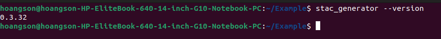

## Setup

This tutorial demonstrates how to use the STAC generator command-line interface to describe spatio-temporal assets. It covers various scenarios and data types.

### Prerequisites

1. **Download Assets**

    Download the zip file containing the raw assets for this tutorial [here](https://object-store.rc.nectar.org.au/v1/AUTH_2b454f47f2654ab58698afd4b4d5eba7/mccn-test-data/example.zip). Extract it into a folder named `Example`.

2. **Install STAC Generator**

    [Install](./index.md#installation) the stac_generator package either globally or within a virtual environment.

3. **Open Terminal in `Example`**

    - **Windows**: right click and select the option `Open in Terminal`.
    - **Mac**: right click and select the option `New Terminal at Folder`.
    - **Linux**: right click and select `Open in Terminal`.

### Verifying Installation

Run the following command in the terminal to ensure the stac_generator is installed correctly:

```bash
stac_generator --version
```
Expected output:



### Generating STAC Records

To create a STAC-compliant record, you need to provide additional metadata using configuration files. Configurations define STAC items in a collection. At a minimum, a config file should include:

- `location`: path to the asset
- `id`: Unique identifier
- `collection_date`: date of asset collection
- `collection_time`: time of asset collection

Note that config fields can be entered in any order.

Supported config formats:

- Preferred: json, yaml
- Limited use: csv

Example configurations are included in the config folder of the extracted zip file.

*Note*: The tutorial configs differ slightly from these due to their use of cloud-based asset URLs.
