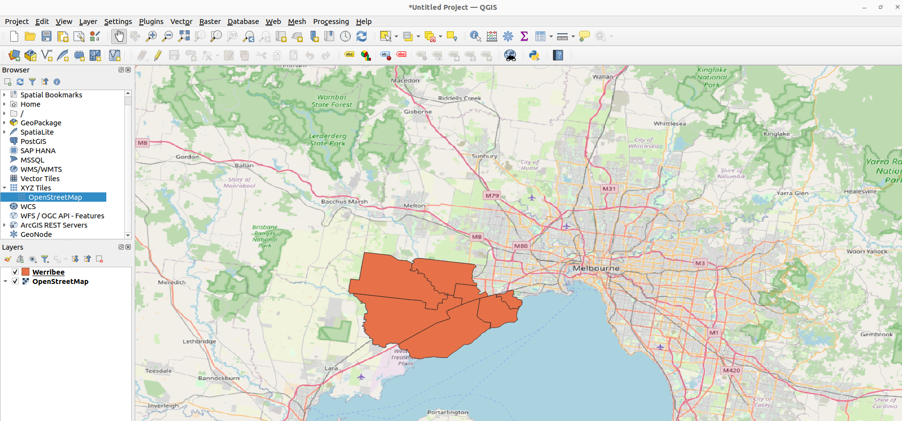

This section focuses on describing only the geometry of a shape file (`.shp`, `.geojson`, etc). We will use the asset `Werribee.geojson` included in the downloaded zip file.

If you have QGIS installed, you can open the file in QGIS to visualize the data:



### Config

To describe the shape file, create a configuration file named `vector_simple_config` in one of the supported formats: JSON or YAML.

=== "json"

    ``` json title="vector_simple_config.json" linenums="1"
    [
      {
        "id": "Werribee",
        "location": "Werribee.geojson",
        "collection_date": "2025-01-01",
        "collection_time": "00:00:00"
      }
    ]
    ```

=== "yaml"

    ``` yaml title="vector_simple_config.yaml" linenums="1"
    - id: "Werribee"
      location: "Werribee.geojson"
      collection_date: "2025-01-01"
      collection_time: "00:00:00"
    ```


### Field Explanation

- `id`: the unique identifier for the item. Note that items in a collection must have unique identifiers.
- `location`: the relative path to the asset file.
- `collection_date`: the date the asset was collected.
- `collection_time`: the time the asset was collected.

Note that these fields are the minimum required set of fields to describe an asset as outlined [previously](./setup.md#generating-stac-records). If `location` points to a non-existent file, or if the STAC generator cannot access the file through `location`, the program will raise an error.

Save the file in the current directory as `vector_simple_config.json` or `vector_simple_config.yaml`.

### Command and Output

Now run the stac generator serialise command from the terminal:

```bash
stac_generator serialise vector_simple_config.json
```

After running the command, a new folder named generated will appear in the current directory. Inside the generated folder, you will find:

- collection.json: Contains the STAC Collection metadata.

- Werribee/Werribee.json: Contains the STAC Item metadata for our simple vector.

The `collection.json` and `Werribee.json` files represent the metadata for your asset, compliant with the STAC specification.
